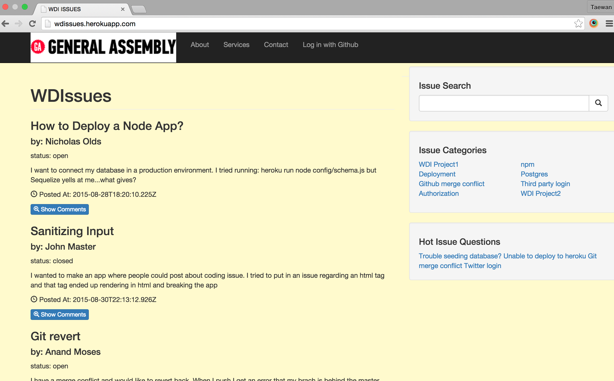

# WDIssues- GA WDI Collaboration Project

##Screenshot

##Project description
WDIssues – An application designed to help students & instructors of the WDI Program.

**Reason:**
As past and present users of Git issues, we feel there is an opportunity to build an in-house WDI specific issue application. This would make it easier for both students and instructors going forward as the number of students joining GA increases.

**Features:**
(a). Issue system specific to WDI
(b). Better time management for students & instructors
(c). Students can view archived issues from previous cohorts
(d). Easier for Instructors to divide issues up.

## General approach you took:
- **Friday(Planning):**
Team brainstormed on potential ideas, we researched on projects individually and ended the day by discussing these with the team. Setup a Slack group and Trello project planning folder.(Trello:  https://trello.com/b/kjnoNi94/)
- **Saturday(Planning):**
We continued our discussion from Friday and then decided to go with an application that would handle WDI specific issues, as this was what the team felt most passionate about.
- **Monday(Code day!):**
Started to code. Setup the initial express app, with models and views.
- **Tuesday:**
Deployed!
- **Wednesday:**
Worked on front end models and views. Really felt a frontend framework would have made it easier! Implemented handlebars.
Thursday: Worked on User model, third party login through GitHub.
- **Friday:**
Bootstrap. Redeployed, changed URL address. Debugged and cleaned code. Passed HTML & CSS validators.

##Installation instructions for any dependencies:
- At the Terminal: Fork and clone project from https://github.com/nolds9/wdi_project_3
- Change directory to the cloned repo
- Install dependencies : npm install
- Create database: created wdissues_db
- Migrate and load seeds to the database:
- node config/schema.js
- node config/seeds.js
- Create an env.js file, make sure to export your github client ID and callback URL
- Open application locally: nodemon

##Any unsolved problems or major hurdles
a. Timeboxing, trying to stay true to accomplish scope.
